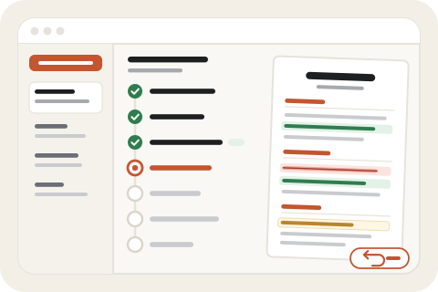

  

# Resume Tailor

  

Didn't work? Create a Studio workspace and paste this to your agent:
` /use-template https://github.com/benjuntilla/resume-tailor`

## Why you care

Paste a job link and watch an AI agent tailor your RenderCV resume to it step by step, then keep or undo each change. One git branch per job.

Tailoring a resume for every application is slow, and handing the whole job to
an AI means trusting edits you never saw. Resume Tailor does the tedious part
for you, shows its work as it goes, and lets you keep or undo each change, with
every job's version saved on its own so your main resume stays untouched.

## How to use it

You need a resume kept as a [RenderCV](https://rendercv.com) `base.yaml` in a
GitHub repo. On setup, the agent connects GitHub, clones that repo into the
workspace, and adds the tailoring instructions (`resume_repo_starter/`) if your
repo does not have them yet. Then open **Resume Tailor**:

1. **Paste a job link** and click **Tailor resume**. No link, or the page needs a
   login? Choose "Paste the description instead".
2. **Watch it work.** The window lists each step as it runs: read the posting, set
   up a separate copy for this job, work out what the job wants, reorder skills,
   reword experience bullets, swap projects, update coursework and bolded words,
   build the PDF and check it fits one page, save. Open any step to see what changed
   and why. A run takes several minutes; you can close the window and come back.
3. **Review the result.** Tabs show the tailored resume, your original, and the
   job posting side by side. **Review edits** lists every change from your main
   resume. Click **Undo** on any you don't want and the PDF rebuilds; undone
   changes can be restored. Anything the agent brought back from your
   commented-out (hidden) entries is flagged so you can check it is still
   accurate.
4. **Download the PDF** and apply.

Every job lives on its own branch in your resume repo, `tailor/<company>-<role>`,
with the posting and a change log alongside the resume. Past jobs are listed in the
sidebar; **Refresh** picks up versions saved from elsewhere.

## Ideas for making it yours

- Add a cover-letter step that drafts a letter from the same posting and saves it
  next to the tailored resume on the job's branch.
- Keep a short "always mention" / "never mention" list in the resume repo and have
  the tailoring instructions honour it.
- Add an application tracker to the sidebar: mark each job applied, interviewing,
  or closed, stored in the job's own record.
- Batch mode: paste several links at once and let them queue overnight.
- Switch the tailoring model to a cheaper one for quick drafts, keeping the larger
  model for applications that matter most.

## License

The Resume Tailor app (everything under [`system/apps/resume_tailor/`](system/apps/resume_tailor/)) is released under the [MIT License](system/apps/resume_tailor/LICENSE). The rest of this repository is the Imbue Studio workspace template it was built on, which is not covered by that license.

## What this is

This repository is a published **Imbue Studio template**: a clean, bootable
snapshot of what an agent built, ready to adapt into your own. It is NOT the
generic workspace template -- it is this specific project.

[`template.md`](template.md) is the full manifest -- what it is, how it
works, what it needs to run, and what to adapt -- with the
machine-readable half (recipe, requirements, and the environment it needs
installed) in [`template.toml`](template.toml).
